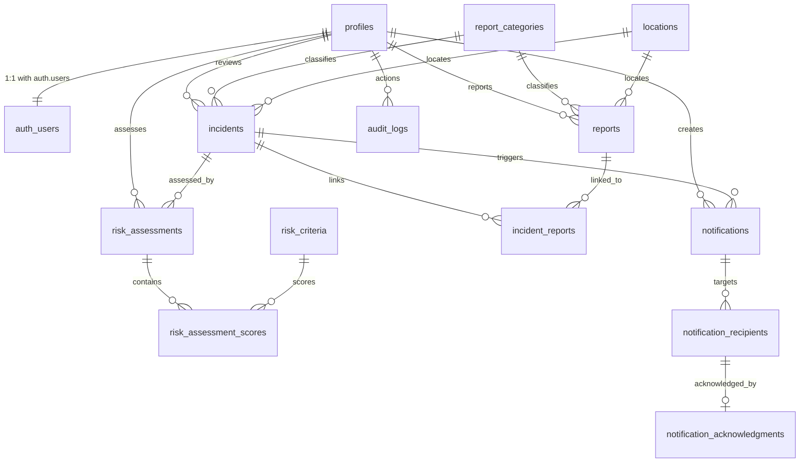

# Document 04 — Database Design Specification (PROPOSED)

**Status:** Draft **v0.3** — revision for human review, 2026-10-04. **NOT
APPROVED** (disposition O-07: document remains proposed; the reserved slot
`docs/database-design.md` is not replaced).
No SQL has been written; no tables exist on the Supabase project.

**Branch:** `feature/database-schema` · **Reserved approved slot:**
`docs/database-design.md` (placeholder untouched).

**Revision history:**
- v0.1 — initial proposal
- v0.2 — dispositions D-01…D-14 incorporated; least-privilege, server
  authorization boundary, conflicts analysis added
- v0.3 — dispositions O-01…O-07 incorporated; send-execution + reapproval
  rules, community-feed allowlist, technical-review clarifications
  (service_role, audit-limitation, administrative access, server-side
  enforcement verification) added

## 1. Purpose and scope

Proposed PostgreSQL schema (Supabase) for the **one-school research prototype**
(single site, no multi-school/tenant modeling — scope preserved):
community-driven hazard/incident reporting, incident correlation,
multi-criteria risk assessment, approval-gated notifications, acknowledgment
tracking, and audit logging — with Row Level Security on every table.

**Applied dispositions:**

| ID | Disposition (applied in) |
|---|---|
| D-01 | `text` + `CHECK` constraints, not PG enums (§3) |
| D-02 | Four roles retained; least-privilege matrix + role self-escalation blocked (§7, §8, §16 V-05) |
| D-03 | Reporting requires authentication; no public anonymous inserts (§5.3, §8) |
| D-04 | Attachments/Storage deferred from v1 (§5.8) |
| D-05 | `anon` denied on every application table (§8, §16 V-06) |
| D-06 | Administrator approval required for all notifications in v1 (§5.6, §7) |
| D-07 | Members receive only allowlisted, sanitized, server-delivered community data (§5.4, §7, §8, §12) |
| D-08 / O-02 | Criteria, weights, scales, thresholds deferred to risk-module methodology (§5.2, §5.5) |
| D-09 / O-01 | Reference values proposed, **every unverified value marked `[CONFIRM]`**; no official school names invented, no institutional approval claimed (§5.2) |
| D-10 | Audit events from trusted backend operations; append-only safeguards (§9) |
| D-11 / O-03 | **No permanent deletion in v1** without approved policy + authorization; retention periods **pending institutional approval**; separate data-retention policy required **before real personal data** (§10) |
| D-12 | Tokyo region documented; privacy/data-residency review required before real personal data (§10.3) |
| D-13 | Deterministic synthetic fixtures, reserved `.invalid` domains, explicit indicators (§11, §16 V-07) |
| D-14 | No soft-delete columns in v1 (§3) |
| O-04 | Administrator or designated safety_officer may **execute** an approved notification; approval identity preserved; executor recorded separately; substantive message change **invalidates approval** (§5.6, §7, §8) |
| O-05 | Community feed = explicit allowlist with named exclusions (§10.1) |
| O-06 | **In-app notifications only in v1**; SMS/email/external messaging deferred (§5.6) |
| O-07 | Document stays proposed; `docs/database-design.md` untouched (status header) |

## 2. Design principles and constraints

- **One-school prototype:** no school/tenant table.
- **RLS mandatory and deny-by-default** on every table; policies enforce
  data rules at the database — the frontend is never the enforcement layer
  (RLS must not rely solely on frontend restrictions).
- **Sensitive data access is server-authorized:** approval, send,
  acknowledgment, audit, and all state transitions run in Pages Functions
  with `service_role` (§12, §16).
- **`anon` may never read or write application tables** (D-05); the anon key
  in the client bundle is protected only by RLS + privileges.
- **Supabase Auth only** for identity; no credentials in tables.
- **Free tier only**; extensions limited to Supabase defaults (`pgcrypto`
  for `gen_random_uuid()`).
- **Synthetic data only** until privacy review passes (D-12/D-13, §10.3).
- **No SQL migrations** until this document is approved.

## 3. Conventions (D-01, D-14)

- Tables: plural `snake_case`; columns: `snake_case`.
- PKs: `uuid` default `gen_random_uuid()`; append-only `audit_logs` uses
  `bigint generated always as identity`.
- Timestamps: `timestamptz` (UTC); `created_at`/`updated_at` maintained by
  trigger; school-local rendering is an application concern.
- State fields: **`text` + `CHECK` constraints** (D-01).
- **No soft-delete columns in v1** (D-14); deletion only under an approved
  policy (§10.2).
- `ON DELETE`: `CASCADE` for owned children; `RESTRICT` for reference data
  and accountability references (`reporter_id`, `assessor_id`,
  `approved_by`, `sent_by` — accountability must survive; see C-03);
  `SET NULL` for non-critical actor references (`opened_by`, `linked_by`).
- `is_synthetic` boolean on data-bearing tables (profiles, reports,
  incidents, assessments, notifications) — explicit synthetic indicator.

## 4. Entity relationship overview

## 5. Entities and attributes

### 5.1 `profiles` — application identity (1:1 with `auth.users`)
| Column | Type | Constraints |
|---|---|---|
| `id` | uuid | PK, references `auth.users(id)` ON DELETE CASCADE |
| `role` | text | NOT NULL DEFAULT 'member', CHECK IN ('administrator','safety_officer','member','viewer') (D-02) |
| `display_name` | text | NOT NULL, 1–60 chars (pseudonymous allowed) |
| `is_active` | boolean | NOT NULL DEFAULT true |
| `is_synthetic` | boolean | NOT NULL DEFAULT false |
| `created_at`/`updated_at` | timestamptz | NOT NULL DEFAULT now() |

**Role self-escalation prevention (D-02 — two independent database layers):**
(1) column-level privileges: `REVOKE ALL … FROM anon, authenticated;
GRANT SELECT, UPDATE(display_name) ON profiles TO authenticated` — clients
physically cannot write `role` or `is_active`; (2) defensive `BEFORE UPDATE`
trigger raising an exception when `role`/`is_active` changes unless the
request JWT role is `service_role`. Role assignment happens only in backend
Functions. No policy grants role writes to anyone (§16 V-05).

### 5.2 Reference data (controlled configuration)

**Schema:**
- **`report_categories`** — `id` uuid PK; `code` text UNIQUE NOT NULL; `name`
  text NOT NULL; `description` text; `sort_order` int; `is_active` boolean
  DEFAULT true; timestamps.
- **`locations`** — `id` uuid PK; `code` text UNIQUE; `name` text NOT NULL;
  `zone` text; `latitude`/`longitude` numeric(9,6) NULL; `is_active` boolean;
  timestamps. Intra-school places only.
- **`risk_criteria`** — `id` uuid PK; `code` text UNIQUE; `name` text;
  `weight` numeric(5,3) CHECK (`weight` > 0); `scale_min` smallint DEFAULT 1;
  `scale_max` smallint DEFAULT 5; `description` text; `is_active` boolean;
  timestamps. **Content deferred to risk-module methodology (D-08/O-02).**
- **`risk_thresholds`** — `id` uuid PK; `level` text CHECK IN ('low',
  'moderate','high','critical') UNIQUE; `min_score`/`max_score` numeric(7,3)
  CHECK (`min_score` <= `max_score`); `action_hint` text.
  **Values deferred (D-08/O-02).**

**Proposed reference values (O-01):** retained from v0.2, every value keeps
its `[CONFIRM]` marker. **These are generic placeholders only — they are not
official school location names, and no institutional approval is claimed or
implied.** Final values require confirmation by the researcher/school.

`report_categories` — all rows **[CONFIRM]**:

| code | name | description |
|---|---|---|
| FIRE | Fire / Smoke | Fire or smoke observed on school grounds |
| FLOOD | Flood / Water Hazard | Flooding, standing water, or major leakage |
| STRUCT | Structural Damage | Cracks, collapse risk, damaged fixtures |
| HEALTH | Health / Medical Hazard | Illness cluster, sanitation, medical incident |
| SEC | Security / Safety Concern | Unauthorized entry, fight, unsafe behavior |
| ENV | Environmental Hazard | Chemical spill, odor, air quality, pests |
| OTHER | Other Hazard | Not covered above; classified on review |

`locations` — generic placeholders, all rows **[CONFIRM]** (not official
names):

| code | name |
|---|---|
| MAIN-GATE | Main Gate |
| SIDE-GATE | Side Gate |
| BLOCK-A | Classroom Block A |
| BLOCK-B | Classroom Block B |
| GYM | Covered Court / Gymnasium |
| LAB | Science Laboratory |
| LIB | Library |
| CANTEEN | Canteen |
| CLINIC | Clinic |
| GROUNDS | Open Grounds |

Reference rows are **controlled configuration** (migration/seed), distinct
from synthetic test fixtures (§11); no `is_synthetic` flag on reference data.

### 5.3 `reports` — community hazard/incident reports
| Column | Type | Constraints |
|---|---|---|
| `id` | uuid | PK DEFAULT gen_random_uuid() |
| `reporter_id` | uuid | FK → profiles(id) ON DELETE RESTRICT, NOT NULL |
| `category_id` | uuid | FK → report_categories(id) RESTRICT, NOT NULL |
| `location_id` | uuid | FK → locations(id) SET NULL, NULL allowed |
| `occurred_at` | timestamptz | NOT NULL, CHECK (≤ now() + 5 min) |
| `description` | text | NOT NULL, CHECK 10–2000 chars |
| `claimed_severity` | smallint | NULL, CHECK 1–5 |
| `status` | text | NOT NULL DEFAULT 'submitted', CHECK IN ('submitted','under_review','linked','dismissed','resolved','withdrawn') |
| `latitude`/`longitude` | numeric(9,6) | NULL |
| `is_anonymous` | boolean | DEFAULT false — display-hiding only; identity always stored |
| `is_synthetic` | boolean | DEFAULT false |
| `created_at`/`updated_at` | timestamptz | NOT NULL DEFAULT now() |

**D-03:** creation requires authentication; `reporter_id` always equals the
authenticated `auth.uid()`; no anonymous submission path exists. Only
`submitted` rows may be corrected/withdrawn by their author (backend rules +
RLS).

Indexes: `(status, created_at DESC)`, `(category_id)`, `(location_id)`,
`(reporter_id, created_at DESC)`, `(occurred_at)`.

### 5.4 Incident correlation
- **`incidents`** — `id` uuid PK (serves as the **public incident reference**
  in community output — no sequential numbering, §10.1); `title` text NOT
  NULL (1–120) *internal*; `category_id` FK RESTRICT; `location_id` FK SET
  NULL; `status` text NOT NULL DEFAULT 'open' CHECK IN ('open',
  'investigating','contained','closed','invalid'); `severity` smallint NULL
  CHECK 1–5 *internal*; `first_reported_at`/`last_reported_at` timestamptz
  NOT NULL; `opened_by` FK → profiles SET NULL; `closed_at` timestamptz NULL;
  `summary` text *internal, officer-facing*; **community publication fields
  (O-05):** `community_summary` text NULL (approved), `community_guidance`
  text NULL (approved safety guidance), `is_community_visible` boolean NOT
  NULL DEFAULT false, `community_published_at` timestamptz NULL,
  `community_updated_at` timestamptz NULL — all community fields written by
  administrator/safety_officer via backend; `is_synthetic` boolean;
  timestamps. Indexes: `(status, created_at DESC)`, `(location_id)`,
  `(category_id)`, `(is_community_visible) WHERE is_community_visible`.
- **`incident_reports`** — `id` uuid PK; `incident_id` FK CASCADE NOT NULL;
  `report_id` FK CASCADE NOT NULL UNIQUE (report joins ≤ 1 incident);
  `link_method` text CHECK IN ('manual','auto') NOT NULL; `link_confidence`
  numeric(4,3) NULL CHECK 0–1; `linked_by` FK → profiles SET NULL;
  `linked_at` timestamptz NOT NULL DEFAULT now(). Index: `(incident_id)`.

### 5.5 Multi-criteria risk assessment (content deferred — D-08/O-02)
- **`risk_assessments`** — `id` uuid PK; `incident_id` FK CASCADE NOT NULL;
  `assessor_id` FK → profiles RESTRICT NOT NULL; `method` text NOT NULL
  DEFAULT 'multi_criteria_v1'; `overall_score` numeric(7,3) NOT NULL CHECK ≥
  0; `risk_level` text NOT NULL CHECK IN ('low','moderate','high','critical');
  `is_current` boolean NOT NULL DEFAULT true with partial UNIQUE index on
  `(incident_id) WHERE is_current`; `rationale` text; `assessed_at`
  timestamptz NOT NULL DEFAULT now(); timestamps.
- **`risk_assessment_scores`** — `id` uuid PK; `assessment_id` FK CASCADE NOT
  NULL; `criterion_id` FK → risk_criteria RESTRICT NOT NULL; `score`
  numeric(6,3) NOT NULL; `weighted_score` numeric(7,3); UNIQUE
  `(assessment_id, criterion_id)`.

Criterion codes, weights, scales, and threshold bands arrive with the
approved risk methodology (O-02) in the risk-module phase; internal risk
scores are never part of community output (§10.1).

### 5.6 Notifications — approval (D-06), execution (O-04), acknowledgment
- **`notifications`** — `id` uuid PK; `incident_id` FK → incidents SET NULL
  NULL; `type` text NOT NULL CHECK IN ('incident_update','risk_alert',
  'system'); `title` text NOT NULL (1–120); `body` text NOT NULL (1–2000);
  `target_mode` text NOT NULL DEFAULT 'role' CHECK IN ('role','all_members');
  `target_role` text NULL CHECK IN role set; `status` text NOT NULL DEFAULT
  'draft' CHECK IN ('draft','pending_approval','approved','rejected','sent',
  'cancelled'); `requires_approval` boolean NOT NULL DEFAULT true — **every
  notification requires administrator approval in v1 (D-06)**; `created_by`
  FK → profiles RESTRICT NOT NULL; `approved_by` FK → profiles **RESTRICT**
  NULL (approval identity preserved, O-04); `approved_at` timestamptz;
  `rejection_reason` text; **`sent_by` FK → profiles RESTRICT NULL — new in
  v0.3: executor recorded separately from approver (O-04)**;
  `sent_at` timestamptz; `is_synthetic` boolean; timestamps.
  CHECKs: `'approved'` ⇒ `approved_by` + `approved_at` NOT NULL;
  `'rejected'` ⇒ `rejection_reason` NOT NULL;
  `'sent'` ⇒ `approved_by` + `approved_at` + `sent_by` + `sent_at` NOT NULL
  (cannot send without approval — enforcement V-04).
  **Reapproval rule (O-04):** while `status = 'approved'` (not yet sent),
  any substantive change to `title`, `body`, `type`, `target_mode`, or
  `target_role` must reset `status` to `'pending_approval'` and clear
  `approved_by`/`approved_at`; the invalidated approval is preserved in
  `audit_logs`. After `status = 'sent'`, message fields are immutable —
  revised content requires a new notification.
  Indexes: `(status, created_at DESC)`, `(incident_id)`, `(created_by)`.
  **Channels (O-06): v1 is in-app only** — no SMS, email, or external
  messaging integration; deferred to a later, separately approved phase.
- **`notification_recipients`** — `id` uuid PK; `notification_id` FK CASCADE
  NOT NULL; `recipient_id` FK → profiles CASCADE NOT NULL; `delivered_at`
  timestamptz NULL (in-app delivery timestamp); UNIQUE
  `(notification_id, recipient_id)`. Expansion is a backend operation at
  approval/send time.
- **`notification_acknowledgments`** — `id` uuid PK; `recipient_row_id` uuid
  FK → notification_recipients CASCADE NOT NULL UNIQUE; `read_at` timestamptz
  NULL; `acknowledged_at` timestamptz NULL; `note` text NULL (≤200 chars).
  **Writes (create/update) are server-side only** (v0.3 change — see §8/§12);
  clients read their own rows.

### 5.7 `audit_logs` — append-only (D-10)
| Column | Type | Constraints |
|---|---|---|
| `id` | bigint | PK GENERATED ALWAYS AS IDENTITY |
| `actor_id` | uuid | FK → profiles SET NULL; NULL = system/service_role |
| `action` | text | NOT NULL (e.g. `report.status_changed`, `notification.approved`, `notification.approval_invalidated`, `notification.executed`, `notification.acknowledged`, `profile.role_changed`) |
| `table_name` | text | NOT NULL |
| `record_id` | text | NOT NULL (uuid serialized as text) |
| `old_data`/`new_data` | jsonb | NULL — sanitized values, never secrets |
| `request_id` | text | NULL — Pages Function correlation id |
| `created_at` | timestamptz | NOT NULL DEFAULT now() |

Indexes: `(table_name, record_id, created_at DESC)`,
`(actor_id, created_at DESC)`. Safeguards and their limits: §9.

### 5.8 Deferred (D-04)
`report_attachments` and all Supabase Storage usage are **deferred from v1**.

## 6. Supabase Auth identity relationship

- `auth.users` ←1:1→ `profiles.id` FK with CASCADE.
- Sign-up/sign-in via Supabase Auth only; credentials never copied into
  application tables.
- Backend Function (service_role) upserts `profiles` on first sign-in with
  default role `member`, checking `is_active`.
- JWT roles used by RLS: `anon`, `authenticated`, `service_role` — with §8
  rules, `anon` matches zero policies (D-05, V-06).
- Account-deletion interaction: conflict C-03 (§14).

## 7. Role-based access model — least privilege (D-02, D-06, D-07, O-04)

**Principle:** minimum capability per role; every sensitive operation runs
server-side (§12) after the backend verifies the caller's JWT role.

| Capability | administrator | safety_officer | member | viewer | anon |
|---|---|---|---|---|---|
| Read own profile; update own `display_name` | ✔ | ✔ | ✔ | ✔ | ✖ |
| Assign roles / activate-deactivate users | ✔ (backend) | ✖ | ✖ | ✖ | ✖ |
| Create report (as self) | ✔ | ✔ | ✔ | ✖ | ✖ |
| Read own reports; correct/withdraw while `submitted` | ✔ (own) | ✔ (own) | ✔ (own) | ✖ | ✖ |
| Read all reports / report status transitions | ✔ (backend) | ✔ (backend) | ✖ | ✖ | ✖ |
| Create/link/close incidents; write community fields | ✔ (backend) | ✔ (backend) | ✖ | ✖ | ✖ |
| Risk assessment create/replace `is_current` | ✔ (backend) | ✔ (backend) | ✖ | ✖ | ✖ |
| Create notification draft | ✔ | ✔ | ✖ | ✖ | ✖ |
| **Approve/reject notification** | **✔ (backend)** | **✖ (D-06)** | ✖ | ✖ | ✖ |
| **Execute (send) an already-approved notification** | **✔ (backend)** | **✔ (backend) — designated safety_officer, O-04** | ✖ | ✖ | ✖ |
| Read notifications delivered to them | ✔ | ✔ | ✔ | ✖ | ✖ |
| Read own acknowledgment rows; request ack via server | ✔ | ✔ | ✔ | ✖ | ✖ |
| Read sanitized community feed (allowlist, server endpoint) | ✔ | ✔ | ✔ (O-05) | ✔ (O-05) | ✖ (D-05) |
| Read reference data (category/location names) | ✔ | ✔ | ✔ (form) | ✔ | ✖ |
| Read risk criteria/thresholds | ✔ | ✔ | ✖ | ✖ | ✖ |
| Read audit logs | ✔ (backend) | ✖ | ✖ | ✖ | ✖ |

O-04 note: approval identity (`approved_by`) and execution identity
(`sent_by`) are stored separately; the same user may be both, but the audit
trail distinguishes the acts. "Designated safety_officer" = holder of the
`safety_officer` role in v1 (interpretation flagged as open item O-08).

## 8. Proposed Row Level Security policies

Every table: `ENABLE ROW LEVEL SECURITY`, deny-by-default. All policies are
explicitly `TO authenticated` — **no policy exists for `anon` on any table
(D-05, V-06)**; Supabase's default schema-wide grants are revoked (C-01).
Policies are the database-level backstop; primary enforcement of sensitive
transitions is server-side (§12, V-04).

| Table | Policies |
|---|---|
| `profiles` | SELECT own row only. UPDATE own row, **column grant `display_name` only** + role-freeze trigger (D-02). INSERT/DELETE: service_role only. |
| `report_categories`, `locations` | SELECT `authenticated`. Write: service_role only. |
| `risk_criteria`, `risk_thresholds` | SELECT safety_officer/administrator only. Write: service_role only. |
| `reports` | INSERT `authenticated` AND `reporter_id = auth.uid()` (D-03). SELECT own rows (officers read others via backend). UPDATE own rows while `status='submitted'`, allowed columns only. DELETE: none. |
| `incidents`, `incident_reports` | SELECT officer/administrator (members: server feed only, D-07/O-05). INSERT/UPDATE officer/administrator (backend is primary path). DELETE: none. |
| `risk_assessments`, `risk_assessment_scores` | SELECT officer/administrator. INSERT/UPDATE officer/administrator with `assessor_id = auth.uid()` for non-admins. DELETE: none. |
| `notifications` | SELECT `created_by = auth.uid()` OR administrator (members read via recipient rows). INSERT officer/administrator with `created_by = auth.uid()`, `status='draft'`. UPDATE: administrator approval transitions with `approved_by = auth.uid()` (D-06); creators edit own drafts only while `status='draft'`; approved-message invalidation/reapproval handled server-side. |
| `notification_recipients` | SELECT `recipient_id = auth.uid()` OR administrator. INSERT/UPDATE: service_role only. |
| `notification_acknowledgments` | SELECT own (via recipient join) OR administrator. **INSERT/UPDATE: service_role only** (v0.3: acknowledgment transitions are server-side, V-04). |
| `audit_logs` | **No policies** ⇒ RLS deny-all for `anon`/`authenticated`; INSERT by service_role only, with privileges additionally restricted (§9). |

Column-level privileges: clients hold `UPDATE` only on
`profiles.display_name`, `reports` (non-privileged fields while
`submitted`), and — for reads — nothing else. State columns (`status`,
`role`, `is_active`, approval/execution fields, community fields) are
backend-writable only. REVOKE + policies at both layers (defense in depth).

## 9. Audit logging requirements and limits (D-10, review items 1–3)

- **Mechanism:** audit rows are written by **trusted backend operations**
  (Pages Functions using `service_role`). Every state transition is routed
  through the backend (§12), so transition coverage is complete by
  construction. No client code path writes audit rows.
- **Audited events (minimum):** report status transitions; incident
  create/link/close and community publication; risk assessment create and
  `is_current` swaps; notification draft→pending→approved/rejected;
  approval invalidation (O-04); execution (`sent_by`); recipient expansion;
  acknowledgments; profile role/activation changes; reference-data changes;
  any retention purge.
- **Append-only protections:** `BEFORE UPDATE OR DELETE` trigger raises an
  exception for every role **including `service_role`** (triggers fire
  regardless of RLS bypass); RLS deny-all for `anon`/`authenticated`;
  `REVOKE UPDATE, DELETE, TRUNCATE ON audit_logs FROM anon, authenticated,
  service_role` (INSERT retained for `service_role` only).
- **Explicit limitation (review item 2):** these protections constrain
  *application roles*, **not privileged database owners.** The database
  owner/superuser (`postgres`), anyone with Supabase Studio/SQL Editor
  access, or anyone able to drop triggers/alter privileges can still modify
  audit records or any other data. Append-only is an application-level
  guarantee plus governance, not a cryptographic or owner-proof chain of
  custody. *Mitigation:* controlled administrative access (below).
- **Controlled administrative access (review item 3):** Supabase Studio,
  SQL Editor, and the service_role key are restricted to designated project
  administrators; the service_role key exists only in backend secrets
  (AGENTS.md); all schema changes occur only through reviewed migrations
  (git-workflow §6); every administrative session is expected to follow the
  same audit discipline, and owner-level misuse is out of application scope
  but noted in project risk documentation.
- **Authorized retention procedure (review item 3):** purge runs only after
  (1) an approved data-retention policy exists, (2) explicit human
  authorization for that purge, (3) a reviewed migration/one-time script
  that temporarily restores the required privileges, (4) an audit entry
  recording the purge. No purge exists in v1 (O-03).
- **Content rules:** sanitized snapshots and identifiers only — never
  passwords, tokens, JWTs, or service keys; `request_id` links rows to Pages
  Function invocations.

## 10. Data privacy and retention (D-11/O-03, D-12, O-05)

### 10.1 Privacy rules and the community-feed allowlist (O-05)
- No learner PII; reports must not name learners/staff beyond the reporter's
  own account; `display_name` may be pseudonymous; members never read other
  profiles.
- **Community-facing incident feed — explicit ALLOWLIST** (delivered only by
  a server endpoint, only when `is_community_visible = true`):
  1. **Public incident reference** — `incidents.id` (opaque uuid)
  2. **Hazard category** — category `name` (and `code`)
  3. **Approved community summary** — `community_summary`
  4. **Generalized location when safe** — coarse location `name`/`zone`
     judgment applied server-side; never `latitude`/`longitude`, never
     report-level spot coordinates
  5. **Public incident status** — `status`
  6. **Approved safety guidance** — `community_guidance`
  7. **Publication and update timestamps** — `community_published_at`,
     `community_updated_at`
- **Explicit EXCLUSIONS:** reporter identity (including de-anonymized
  mapping), report `description` text, internal `summary`/`rationale`/
  `title` internals as applicable, internal notes, exact/sensitive location
  coordinates, internal risk scores/levels/criteria (`risk_*` tables
  excluded entirely), internal actor identities (opened_by/linked_by/
  approved_by), and audit data.

### 10.2 Retention policy requirements (O-03 — pending institutional approval)
| Data | Draft proposal (PENDING — not approved) |
|---|---|
| Reports, incidents, assessments | Study period + 12 months → archive extract → authorized purge |
| Notifications + recipients/acks | 12 months after `sent_at` |
| `audit_logs` | 12 months (subject to §9 constraints) |
| Inactive profiles | Keep record, `is_active=false`; anonymize display fields after 12 months |

**Disposition O-03 binding rules:** no permanent deletion of records in v1
without an approved policy and explicit authorization; retention periods
above remain **pending institutional approval**; a **separate data-retention
policy document (`docs/data-retention-policy.md`) must be created and
approved before any real personal data is introduced** — and before any
purge procedure is ever executed.

### 10.3 Data residency gate (D-12)
- Supabase region: **Tokyo (`ap-northeast-1`)** — must be recorded in
  charter/consent materials.
- **Privacy/data-residency review required before any real personal data is
  introduced.** Synthetic-only until that review passes (§11, V-07); real
  learner/staff data remains out of scope for v1.

## 11. Synthetic data strategy (D-13 — V-07)

- Migrations = structure only; fixtures in `supabase/seed.sql`.
- **Deterministic:** fixed UUIDs (`00000000-0000-4000-8000-0000000000NN`)
  and fixed codes; idempotent (`ON CONFLICT DO NOTHING` on natural keys).
- Reserved `.invalid` emails (RFC 2606): e.g.
  `synthetic.member01@example.invalid`.
- Explicit indicators: `is_synthetic = true` on every seeded data row;
  `display_name` pattern `Synthetic <Role> NN`.
- Synthetic users provisioned via backend admin flow only; seeds never run
  against production without explicit approval.
- **Restriction preserved:** the prototype accepts synthetic data only until
  privacy/data-residency review passes (§10.3).

## 12. Server authorization boundary — server-side enforcement verification

RLS and column privileges are the database backstop; primary enforcement is
in Pages Functions (`service_role`), each verifying the caller's JWT role
before acting (review item 4):

| Transition | Server-side enforcement (verified) |
|---|---|
| Notification **approval/rejection** | Backend Function, administrator-only check → `approved_by`/`approved_at` set; RLS mirror policy; CHECK constraint (§5.6) |
| Approval **invalidation** on substantive change (O-04) | Backend computes change, resets to `pending_approval`, clears approval fields, writes `notification.approval_invalidated` audit row |
| Notification **execution/send** | Backend Function, administrator **or** `safety_officer` check → sets `sent_by`/`sent_at`/`delivered_at`; CHECK forbids `sent` without prior approval |
| **Acknowledgment** | Backend Function, recipient-identity check → writes ack rows; clients have read-only access (v0.3 change) |
| **Audit** writes | Backend only; no client path exists; append-only guards (§9) |
| All other state transitions (report status, incident lifecycle, risk `is_current`, roles, reference/community fields) | Backend only (§7 matrix) |

Client-direct operations remain limited to: sign-in, create own report,
correct/withdraw own `submitted` report, read own profile/reports/delivered
notifications/ack rows, and read the allowlisted community feed via the
server endpoint.

## 13. Feature traceability

| Feature | Tables |
|---|---|
| Incident correlation | `reports`, `incidents`, `incident_reports` |
| Multi-criteria risk assessment (content per O-02) | `risk_criteria`, `risk_assessments`, `risk_assessment_scores`, `risk_thresholds` |
| Notification approval (admin, D-06) + execution identity (O-04) | `notifications` (`approved_by`/`approved_at` vs `sent_by`/`sent_at` + CHECKs) |
| In-app-only channels (O-06) | `notification_recipients`, `notification_acknowledgments` |
| Community allowlist feed (O-05) | `incidents` community columns + server endpoint |
| Audit (backend-written, append-only, D-10) | `audit_logs` |
| One-school scope | No tenant table; intra-school `locations` |

## 14. Conflicts with Supabase Auth and PostgreSQL behavior

- **C-01 — Supabase default grants:** `ALL` on `public` schema tables is
  granted to `anon`/`authenticated`. *Resolution:* explicit `REVOKE` +
  minimal `GRANT`s in every migration (V-06).
- **C-02 — RLS is row-level:** policies cannot block updating `role` on
  one's own row. *Resolution:* column grants + role-freeze trigger (V-05).
- **C-03 — Auth user deletion vs FK RESTRICT:** `profiles` cascade with
  `auth.users`, but accountability FKs (`reporter_id`, `assessor_id`,
  `approved_by`, `sent_by`) RESTRICT profile deletion — hard account
  deletion fails while such rows exist. *Resolution (v1):* deactivation
  only (`is_active=false`); hard deletion deferred until the approved
  retention policy (O-03) defines anonymization of accountability
  references.
- **C-04 — `service_role` bypasses RLS (review item 1):** `service_role`
  carries BYPASSRLS semantics — it ignores every policy and row filter and
  typically holds broad table privileges. Consequences, by design:
  (a) the key is never exposed to browsers (backend secrets only);
  (b) Functions must perform explicit authorization checks — policies
  cannot protect against backend bugs (defense in depth, §12);
  (c) RLS deny-all on `audit_logs` does **not** stop `service_role`
  inserts — which is exactly how audit writes occur; (d) the append-only
  **trigger still fires for `service_role`** (triggers are independent of
  RLS) — UPDATE/DELETE on audit rows fail even for the backend; (e) owner/
  superuser limitations as stated in §9.
- **C-05 — `auth.uid()` is NULL for `service_role`:** uid-based policies
  grant the backend nothing (it bypasses RLS anyway) — documented so future
  authors do not rely on `auth.uid()` in backend logic.
- **C-06 — anon key in browsers (approved exception):** any policy granted
  to `anon` would expose data publicly. *Resolution:* zero `anon` policies
  + repository test asserting none exist (V-06).
- **C-07 — verified compatible:** `gen_random_uuid()` (pgcrypto), partial
  unique indexes, `timestamptz`, jsonb, CHECK constraints, column-level
  grants, and trigger guards are all supported by Supabase PostgreSQL — no
  conflict expected.

## 15. Proposed migration sequence (future — no SQL written)

1. `0001_identity.sql` — privilege baseline (C-01), `profiles`, guards, RLS
2. `0002_reference.sql` — reference tables, values `[CONFIRM]` (O-01) + RLS
3. `0003_reporting.sql` — `reports` + RLS
4. `0004_correlation.sql` — `incidents` (+ O-05 community columns),
   `incident_reports` + RLS
5. `0005_risk.sql` — assessment tables + RLS (criteria content per O-02)
6. `0006_notifications.sql` — notifications (+ `sent_by`), recipients,
   acknowledgments + RLS
7. `0007_audit.sql` — `audit_logs`, append-only safeguards, deny-all RLS
8. `0008_fixtures.sql` — deterministic synthetic fixtures (D-13)

Each migration human-reviewed before apply (git-workflow §6), applied only
after this document is approved.

## 16. Technical review verification (v0.3)

| # | Review item | Verified in | Result |
|---|---|---|---|
| V-01 | service_role behavior / RLS bypass | C-04, §9 | Documented: bypasses policies; explicit backend checks required; triggers still apply |
| V-02 | Audit protections vs privileged owners | §9 limitation | Documented: owner/superuser can alter records; mitigated only by controlled access governance |
| V-03 | Controlled admin access + authorized retention | §9 | Documented: restricted Studio/key access; 4-step purge authorization procedure |
| V-04 | Approval/send/ack/audit server-side | §12 table | Verified: all four enforced in backend functions (+ RLS mirrors, + CHECKs) |
| V-05 | No self role escalation | §5.1, §8, C-02 | Verified: column grants block writing `role`; trigger freeze; backend-only assignment; no policy grants role writes |
| V-06 | No public anon access | §8, C-01, C-06 | Verified: zero `anon` policies; default grants revoked; repo test planned |
| V-07 | Synthetic-only restriction preserved | §10.3, §11 | Verified: synthetic-only until privacy/data-residency review; seeds never run on production unprompted |

## 17. Open items after v0.3 dispositions

| ID | Open item | Owner |
|---|---|---|
| O-01 | Confirm/adjust category + location values (all `[CONFIRM]`; not official names) | Human/researcher |
| O-02 | Risk criteria codes, weights, scale, thresholds | Risk-module phase |
| O-03 | Retention periods (pending institutional approval) + `docs/data-retention-policy.md` **before any real personal data** | Human/institution |
| O-08 | Confirm interpretation: "designated safety_officer" = holder of `safety_officer` role (§7) | Human |
| O-09 | Confirm community-feed allowlist + generalized-location rule for each location row (§10.1) | Human |
| O-10 | Overall document approval → then `docs/database-design.md` reconciliation | Human |

*(O-04, O-05, O-06, O-07 resolved by v0.3 dispositions.)*

## 18. Explicitly NOT done in this task

- No SQL written; no migration files created; `supabase/migrations/` untouched.
- No database created/altered; live Supabase project untouched.
- No deployment configuration changes; nothing merged, pushed, or deployed.
- Application code untouched; document remains **draft pending human
  approval** (O-07).
